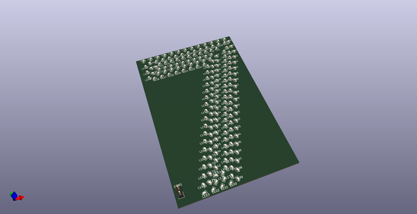
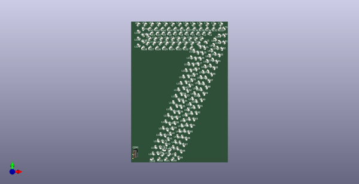
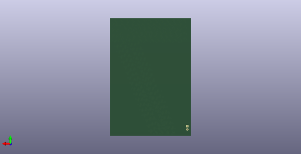
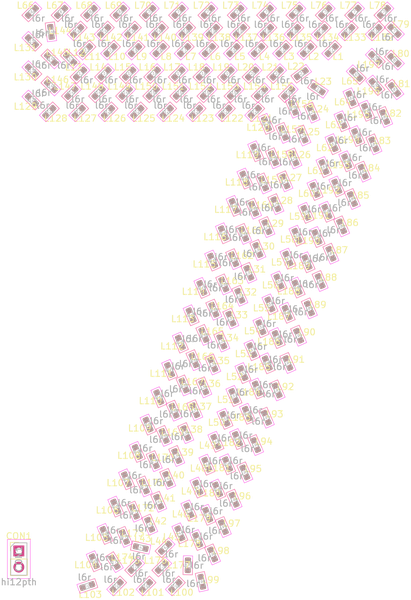

# SVG Component Placement in Kicad
Placing components along a path in Kicad.
##notes
Placing components along a path in Kicad.  
* ibom github: [ibom github](kicad\current_version\working\bom\ibom.html)
* ibom direct: [ibom direct](https://raw.githack.com/oomlout/oomlout_oomp_electronic_project_svg_component_placement/main/kicad/current_version/working/bom/ibom.html)

## pcb  
  
    
  
  
[board (pdf)](kicad/current_version/working/working.pdf)  

## corel working
 

## oomp_parts_summary
| index | designator | quantity | oomp_id | 
| --- | --- | --- | --- | 
| 1 | L2,L12,L35,L165,L51,L37,L11,L80,L14,L94,L134,L69,L193,L36,L23,L22,L180,L82,L30,L107,L181,L20,L15,L102,L55,L71,L43,L148,L145,L158,L53,L98,L166,L155,L49,L18,L146,L111,L33,L40,L81,L183,L75,L171,L143,L24,L167,L64,L38,L41,L59,L117,L105,L120,L142,L164,L84,L156,L108,L176,L130,L168,L151,L45,L114,L54,L29,L133,L42,L79,L74,L135,L144,L31,L87,L17,L66,L106,L159,L70,L149,L138,L161,L44,L123,L100,L188,L83,L6,L89,L34,L137,L67,L73,L103,L95,L60,L154,L13,L184,L16,L152,L9,L1,L190,L192,L77,L86,L173,L124,L101,L136,L194,L147,L26,L62,L179,L56,L160,L128,L196,L141,L178,L104,L115,L177,L109,L185,L191,L157,L169,L112,L10,L126,L131,L72,L19,L58,L99,L5,L91,L195,L125,L85,L27,L189,L187,L7,L57,L121,L163,L32,L93,L197,L88,L3,L186,L153,L25,L61,L21,L68,L110,L162,L119,L48,L139,L170,L47,L76,L97,L175,L50,L4,L96,L140,L113,L172,L39,L65,L90,L150,L118,L174,L78,L129,L28,L132,L52,L63,L122,L182,L92,L46,L127,L8,L116 | 197 | electronic_led_0603_red | 
| 2 | CON1 | 1 | electronic_header_2_54_mm_2_pin_through_hole | 

Search Links: (L) - lcsc, (D) - digikey, (M) - mouser, (N) - newark, (SZ) - szlcsc
note: a work on progress that takes the bom file from kicad pcb and try's to add oomp details

## positions
### top
| # Ref | Val | Package | PosX | PosY | Rot | Side | 
| --- | --- | --- | --- | --- | --- | --- | 
| CON1 | hi12pth | hi12pth_electronic_header_2_54_mm_2_pin_through_hole | -30.5 | -239.5 | 0.0 | top | 
| L1 | l6r | l6r_electronic_led_0603_red | 18.6027 | -161.0 | -135.0002 | top | 
| L2 | l6r | l6r_electronic_led_0603_red | 14.7455 | -161.0 | -135.0002 | top | 
| L3 | l6r | l6r_electronic_led_0603_red | 10.8882 | -161.0 | -135.0002 | top | 
| L4 | l6r | l6r_electronic_led_0603_red | 7.031 | -161.0 | -135.0002 | top | 
| L5 | l6r | l6r_electronic_led_0603_red | 3.1737 | -161.0 | -135.0002 | top | 
| L6 | l6r | l6r_electronic_led_0603_red | -0.6836 | -161.0 | -135.0002 | top | 
| L7 | l6r | l6r_electronic_led_0603_red | -4.5408 | -161.0 | -135.0002 | top | 
| L8 | l6r | l6r_electronic_led_0603_red | -8.3981 | -161.0 | -135.0002 | top | 
| L9 | l6r | l6r_electronic_led_0603_red | -12.2553 | -161.0 | -135.0002 | top | 
| L10 | l6r | l6r_electronic_led_0603_red | -16.1126 | -161.0 | -135.0002 | top | 
| L11 | l6r | l6r_electronic_led_0603_red | -19.9698 | -161.0 | -135.0002 | top | 
| L12 | l6r | l6r_electronic_led_0603_red | -22.45 | -162.3771 | -45.0001 | top | 
| L13 | l6r | l6r_electronic_led_0603_red | -20.8956 | -164.68 | 45.0 | top | 
| L14 | l6r | l6r_electronic_led_0603_red | -17.0384 | -164.68 | 45.0 | top | 
| L15 | l6r | l6r_electronic_led_0603_red | -13.1811 | -164.68 | 45.0 | top | 
| L16 | l6r | l6r_electronic_led_0603_red | -9.3239 | -164.68 | 45.0 | top | 
| L17 | l6r | l6r_electronic_led_0603_red | -5.4666 | -164.68 | 45.0 | top | 
| L18 | l6r | l6r_electronic_led_0603_red | -1.6093 | -164.68 | 45.0 | top | 
| L19 | l6r | l6r_electronic_led_0603_red | 2.2479 | -164.68 | 45.0 | top | 
| L20 | l6r | l6r_electronic_led_0603_red | 6.1052 | -164.68 | 45.0 | top | 
| L21 | l6r | l6r_electronic_led_0603_red | 9.9624 | -164.68 | 45.0 | top | 
| L22 | l6r | l6r_electronic_led_0603_red | 13.8324 | -164.696 | 36.9786 | top | 
| L23 | l6r | l6r_electronic_led_0603_red | 16.4655 | -167.1062 | -34.3104 | top | 
| L24 | l6r | l6r_electronic_led_0603_red | 15.5131 | -170.8008 | -66.5478 | top | 
| L25 | l6r | l6r_electronic_led_0603_red | 14.0972 | -174.3888 | -66.5202 | top | 
| L26 | l6r | l6r_electronic_led_0603_red | 12.6822 | -177.9772 | -66.5202 | top | 
| L27 | l6r | l6r_electronic_led_0603_red | 11.2673 | -181.5655 | -66.5202 | top | 
| L28 | l6r | l6r_electronic_led_0603_red | 9.8523 | -185.1539 | -66.5202 | top | 
| L29 | l6r | l6r_electronic_led_0603_red | 8.4374 | -188.7423 | -66.5202 | top | 
| L30 | l6r | l6r_electronic_led_0603_red | 7.0224 | -192.3306 | -66.5202 | top | 
| L31 | l6r | l6r_electronic_led_0603_red | 5.6075 | -195.919 | -66.5202 | top | 
| L32 | l6r | l6r_electronic_led_0603_red | 4.1925 | -199.5074 | -66.5202 | top | 
| L33 | l6r | l6r_electronic_led_0603_red | 2.7776 | -203.0957 | -66.5202 | top | 
| L34 | l6r | l6r_electronic_led_0603_red | 1.3626 | -206.6841 | -66.5202 | top | 
| L35 | l6r | l6r_electronic_led_0603_red | -0.0523 | -210.2725 | -66.5202 | top | 
| L36 | l6r | l6r_electronic_led_0603_red | -1.4673 | -213.8608 | -66.5202 | top | 
| L37 | l6r | l6r_electronic_led_0603_red | -2.8822 | -217.4492 | -66.5202 | top | 
| L38 | l6r | l6r_electronic_led_0603_red | -4.2971 | -221.0376 | -66.5202 | top | 
| L39 | l6r | l6r_electronic_led_0603_red | -5.7121 | -224.6259 | -66.5202 | top | 
| L40 | l6r | l6r_electronic_led_0603_red | -7.127 | -228.2143 | -66.5202 | top | 
| L41 | l6r | l6r_electronic_led_0603_red | -8.542 | -231.8027 | -66.5202 | top | 
| L42 | l6r | l6r_electronic_led_0603_red | -9.9569 | -235.391 | -66.5202 | top | 
| L43 | l6r | l6r_electronic_led_0603_red | -11.3719 | -238.9794 | -12.6917 | top | 
| L44 | l6r | l6r_electronic_led_0603_red | -7.5449 | -239.0 | 45.0 | top | 
| L45 | l6r | l6r_electronic_led_0603_red | -5.2221 | -236.7462 | 113.4976 | top | 
| L46 | l6r | l6r_electronic_led_0603_red | -3.8083 | -233.1574 | 113.4976 | top | 
| L47 | l6r | l6r_electronic_led_0603_red | -2.3944 | -229.5686 | 113.4976 | top | 
| L48 | l6r | l6r_electronic_led_0603_red | -0.9806 | -225.9798 | 113.4976 | top | 
| L49 | l6r | l6r_electronic_led_0603_red | 0.4333 | -222.391 | 113.4976 | top | 
| L50 | l6r | l6r_electronic_led_0603_red | 1.8471 | -218.8022 | 113.4976 | top | 
| L51 | l6r | l6r_electronic_led_0603_red | 3.261 | -215.2134 | 113.4976 | top | 
| L52 | l6r | l6r_electronic_led_0603_red | 4.6748 | -211.6246 | 113.4976 | top | 
| L53 | l6r | l6r_electronic_led_0603_red | 6.0887 | -208.0358 | 113.4976 | top | 
| L54 | l6r | l6r_electronic_led_0603_red | 7.5025 | -204.447 | 113.4976 | top | 
| L55 | l6r | l6r_electronic_led_0603_red | 8.9164 | -200.8582 | 113.4976 | top | 
| L56 | l6r | l6r_electronic_led_0603_red | 10.3302 | -197.2694 | 113.4976 | top | 
| L57 | l6r | l6r_electronic_led_0603_red | 11.744 | -193.6806 | 113.4976 | top | 
| L58 | l6r | l6r_electronic_led_0603_red | 13.1579 | -190.0918 | 113.4976 | top | 
| L59 | l6r | l6r_electronic_led_0603_red | 14.5717 | -186.503 | 113.4976 | top | 
| L60 | l6r | l6r_electronic_led_0603_red | 15.9856 | -182.9142 | 113.4976 | top | 
| L61 | l6r | l6r_electronic_led_0603_red | 17.3994 | -179.3254 | 113.4976 | top | 
| L62 | l6r | l6r_electronic_led_0603_red | 18.8133 | -175.7366 | 113.4976 | top | 
| L63 | l6r | l6r_electronic_led_0603_red | 20.2271 | -172.1478 | 113.4976 | top | 
| L64 | l6r | l6r_electronic_led_0603_red | 21.641 | -168.559 | 113.4976 | top | 
| L65 | l6r | l6r_electronic_led_0603_red | 22.46 | -164.8573 | 135.0001 | top | 
| L66 | l6r | l6r_electronic_led_0603_red | -28.46 | -155.0 | 45.0 | top | 
| L67 | l6r | l6r_electronic_led_0603_red | -23.854 | -155.0 | 45.0 | top | 
| L68 | l6r | l6r_electronic_led_0603_red | -19.2479 | -155.0 | 45.0 | top | 
| L69 | l6r | l6r_electronic_led_0603_red | -14.6419 | -155.0 | 45.0 | top | 
| L70 | l6r | l6r_electronic_led_0603_red | -10.0358 | -155.0 | 45.0 | top | 
| L71 | l6r | l6r_electronic_led_0603_red | -5.4298 | -155.0 | 45.0 | top | 
| L72 | l6r | l6r_electronic_led_0603_red | -0.8237 | -155.0 | 45.0 | top | 
| L73 | l6r | l6r_electronic_led_0603_red | 3.7823 | -155.0 | 45.0 | top | 
| L74 | l6r | l6r_electronic_led_0603_red | 8.3884 | -155.0 | 45.0 | top | 
| L75 | l6r | l6r_electronic_led_0603_red | 12.9944 | -155.0 | 45.0 | top | 
| L76 | l6r | l6r_electronic_led_0603_red | 17.6005 | -155.0 | 45.0 | top | 
| L77 | l6r | l6r_electronic_led_0603_red | 22.2065 | -155.0 | 45.0 | top | 
| L78 | l6r | l6r_electronic_led_0603_red | 26.8126 | -155.0 | 45.0 | top | 
| L79 | l6r | l6r_electronic_led_0603_red | 28.46 | -157.9586 | -45.0001 | top | 
| L80 | l6r | l6r_electronic_led_0603_red | 28.46 | -162.5646 | -45.0001 | top | 
| L81 | l6r | l6r_electronic_led_0603_red | 28.46 | -167.1707 | -51.7968 | top | 
| L82 | l6r | l6r_electronic_led_0603_red | 26.9252 | -171.4853 | -66.5048 | top | 
| L83 | l6r | l6r_electronic_led_0603_red | 25.2368 | -175.7707 | -66.5048 | top | 
| L84 | l6r | l6r_electronic_led_0603_red | 23.5483 | -180.0561 | -66.5048 | top | 
| L85 | l6r | l6r_electronic_led_0603_red | 21.8598 | -184.3415 | -66.5048 | top | 
| L86 | l6r | l6r_electronic_led_0603_red | 20.1713 | -188.6269 | -66.5048 | top | 
| L87 | l6r | l6r_electronic_led_0603_red | 18.4829 | -192.9123 | -66.5048 | top | 
| L88 | l6r | l6r_electronic_led_0603_red | 16.7944 | -197.1977 | -66.5048 | top | 
| L89 | l6r | l6r_electronic_led_0603_red | 15.1059 | -201.4831 | -66.5048 | top | 
| L90 | l6r | l6r_electronic_led_0603_red | 13.4174 | -205.7685 | -66.5048 | top | 
| L91 | l6r | l6r_electronic_led_0603_red | 11.729 | -210.0539 | -66.5048 | top | 
| L92 | l6r | l6r_electronic_led_0603_red | 10.0405 | -214.3394 | -66.5048 | top | 
| L93 | l6r | l6r_electronic_led_0603_red | 8.352 | -218.6248 | -66.5048 | top | 
| L94 | l6r | l6r_electronic_led_0603_red | 6.6635 | -222.9102 | -66.5048 | top | 
| L95 | l6r | l6r_electronic_led_0603_red | 4.9751 | -227.1956 | -66.5048 | top | 
| L96 | l6r | l6r_electronic_led_0603_red | 3.2866 | -231.481 | -66.5048 | top | 
| L97 | l6r | l6r_electronic_led_0603_red | 1.5981 | -235.7664 | -66.5048 | top | 
| L98 | l6r | l6r_electronic_led_0603_red | -0.0904 | -240.0518 | -66.5048 | top | 
| L99 | l6r | l6r_electronic_led_0603_red | -1.7789 | -244.3372 | -77.912 | top | 
| L100 | l6r | l6r_electronic_led_0603_red | -5.9337 | -245.0 | -135.0002 | top | 
| L101 | l6r | l6r_electronic_led_0603_red | -10.5397 | -245.0 | -135.0002 | top | 
| L102 | l6r | l6r_electronic_led_0603_red | -15.1457 | -245.0 | -135.0002 | top | 
| L103 | l6r | l6r_electronic_led_0603_red | -19.7518 | -245.0 | -161.549 | top | 
| L104 | l6r | l6r_electronic_led_0603_red | -18.6614 | -241.1226 | 113.4837 | top | 
| L105 | l6r | l6r_electronic_led_0603_red | -16.972 | -236.8375 | 113.4837 | top | 
| L106 | l6r | l6r_electronic_led_0603_red | -15.2827 | -232.5525 | 113.4837 | top | 
| L107 | l6r | l6r_electronic_led_0603_red | -13.5933 | -228.2674 | 113.4837 | top | 
| L108 | l6r | l6r_electronic_led_0603_red | -11.904 | -223.9824 | 113.4837 | top | 
| L109 | l6r | l6r_electronic_led_0603_red | -10.2146 | -219.6973 | 113.4837 | top | 
| L110 | l6r | l6r_electronic_led_0603_red | -8.5253 | -215.4122 | 113.4837 | top | 
| L111 | l6r | l6r_electronic_led_0603_red | -6.8359 | -211.1272 | 113.4837 | top | 
| L112 | l6r | l6r_electronic_led_0603_red | -5.1466 | -206.8421 | 113.4837 | top | 
| L113 | l6r | l6r_electronic_led_0603_red | -3.4572 | -202.557 | 113.4837 | top | 
| L114 | l6r | l6r_electronic_led_0603_red | -1.7679 | -198.272 | 113.4837 | top | 
| L115 | l6r | l6r_electronic_led_0603_red | -0.0785 | -193.9869 | 113.4837 | top | 
| L116 | l6r | l6r_electronic_led_0603_red | 1.6108 | -189.7019 | 113.4837 | top | 
| L117 | l6r | l6r_electronic_led_0603_red | 3.3001 | -185.4168 | 113.4837 | top | 
| L118 | l6r | l6r_electronic_led_0603_red | 4.9895 | -181.1317 | 113.4837 | top | 
| L119 | l6r | l6r_electronic_led_0603_red | 6.6788 | -176.8467 | 113.4837 | top | 
| L120 | l6r | l6r_electronic_led_0603_red | 8.3682 | -172.5616 | 113.4837 | top | 
| L121 | l6r | l6r_electronic_led_0603_red | 6.5265 | -170.68 | -135.0002 | top | 
| L122 | l6r | l6r_electronic_led_0603_red | 1.9205 | -170.68 | -135.0002 | top | 
| L123 | l6r | l6r_electronic_led_0603_red | -2.6856 | -170.68 | -135.0002 | top | 
| L124 | l6r | l6r_electronic_led_0603_red | -7.2916 | -170.68 | -135.0002 | top | 
| L125 | l6r | l6r_electronic_led_0603_red | -11.8977 | -170.68 | -135.0002 | top | 
| L126 | l6r | l6r_electronic_led_0603_red | -16.5037 | -170.68 | -135.0002 | top | 
| L127 | l6r | l6r_electronic_led_0603_red | -21.1098 | -170.68 | -135.0002 | top | 
| L128 | l6r | l6r_electronic_led_0603_red | -25.7158 | -170.68 | -135.0002 | top | 
| L129 | l6r | l6r_electronic_led_0603_red | -28.46 | -168.8181 | 135.0001 | top | 
| L130 | l6r | l6r_electronic_led_0603_red | -28.46 | -164.2121 | 135.0001 | top | 
| L131 | l6r | l6r_electronic_led_0603_red | -28.46 | -159.606 | 135.0001 | top | 
| L132 | l6r | l6r_electronic_led_0603_red | 25.46 | -158.0 | -135.0002 | top | 
| L133 | l6r | l6r_electronic_led_0603_red | 21.2057 | -158.0 | -135.0002 | top | 
| L134 | l6r | l6r_electronic_led_0603_red | 16.9514 | -158.0 | -135.0002 | top | 
| L135 | l6r | l6r_electronic_led_0603_red | 12.6971 | -158.0 | -135.0002 | top | 
| L136 | l6r | l6r_electronic_led_0603_red | 8.4428 | -158.0 | -135.0002 | top | 
| L137 | l6r | l6r_electronic_led_0603_red | 4.1885 | -158.0 | -135.0002 | top | 
| L138 | l6r | l6r_electronic_led_0603_red | -0.0658 | -158.0 | -135.0002 | top | 
| L139 | l6r | l6r_electronic_led_0603_red | -4.3201 | -158.0 | -135.0002 | top | 
| L140 | l6r | l6r_electronic_led_0603_red | -8.5744 | -158.0 | -135.0002 | top | 
| L141 | l6r | l6r_electronic_led_0603_red | -12.8287 | -158.0 | -135.0002 | top | 
| L142 | l6r | l6r_electronic_led_0603_red | -17.083 | -158.0 | -135.0002 | top | 
| L143 | l6r | l6r_electronic_led_0603_red | -21.3373 | -158.0 | -135.0002 | top | 
| L144 | l6r | l6r_electronic_led_0603_red | -25.46 | -158.1316 | -82.9445 | top | 
| L145 | l6r | l6r_electronic_led_0603_red | -25.46 | -162.3859 | -45.0001 | top | 
| L146 | l6r | l6r_electronic_led_0603_red | -25.46 | -166.6402 | -44.3512 | top | 
| L147 | l6r | l6r_electronic_led_0603_red | -22.2455 | -167.68 | 45.0 | top | 
| L148 | l6r | l6r_electronic_led_0603_red | -17.9911 | -167.68 | 45.0 | top | 
| L149 | l6r | l6r_electronic_led_0603_red | -13.7368 | -167.68 | 45.0 | top | 
| L150 | l6r | l6r_electronic_led_0603_red | -9.4825 | -167.68 | 45.0 | top | 
| L151 | l6r | l6r_electronic_led_0603_red | -5.2282 | -167.68 | 45.0 | top | 
| L152 | l6r | l6r_electronic_led_0603_red | -0.9739 | -167.68 | 45.0 | top | 
| L153 | l6r | l6r_electronic_led_0603_red | 3.2804 | -167.68 | 45.0 | top | 
| L154 | l6r | l6r_electronic_led_0603_red | 7.5347 | -167.68 | 45.0 | top | 
| L155 | l6r | l6r_electronic_led_0603_red | 11.789 | -167.68 | 45.0 | top | 
| L156 | l6r | l6r_electronic_led_0603_red | 12.5908 | -170.026 | -66.608 | top | 
| L157 | l6r | l6r_electronic_led_0603_red | 11.0279 | -173.9828 | -66.5112 | top | 
| L158 | l6r | l6r_electronic_led_0603_red | 9.4679 | -177.9407 | -66.5112 | top | 
| L159 | l6r | l6r_electronic_led_0603_red | 7.9079 | -181.8987 | -66.5112 | top | 
| L160 | l6r | l6r_electronic_led_0603_red | 6.348 | -185.8567 | -66.5112 | top | 
| L161 | l6r | l6r_electronic_led_0603_red | 4.788 | -189.8147 | -66.5112 | top | 
| L162 | l6r | l6r_electronic_led_0603_red | 3.228 | -193.7727 | -66.5112 | top | 
| L163 | l6r | l6r_electronic_led_0603_red | 1.668 | -197.7306 | -66.5112 | top | 
| L164 | l6r | l6r_electronic_led_0603_red | 0.1081 | -201.6886 | -66.5112 | top | 
| L165 | l6r | l6r_electronic_led_0603_red | -1.4519 | -205.6466 | -66.5112 | top | 
| L166 | l6r | l6r_electronic_led_0603_red | -3.0119 | -209.6046 | -66.5112 | top | 
| L167 | l6r | l6r_electronic_led_0603_red | -4.5718 | -213.5625 | -66.5112 | top | 
| L168 | l6r | l6r_electronic_led_0603_red | -6.1318 | -217.5205 | -66.5112 | top | 
| L169 | l6r | l6r_electronic_led_0603_red | -7.6918 | -221.4785 | -66.5112 | top | 
| L170 | l6r | l6r_electronic_led_0603_red | -9.2518 | -225.4365 | -66.5112 | top | 
| L171 | l6r | l6r_electronic_led_0603_red | -10.8117 | -229.3944 | -66.5112 | top | 
| L172 | l6r | l6r_electronic_led_0603_red | -12.3717 | -233.3524 | -66.5112 | top | 
| L173 | l6r | l6r_electronic_led_0603_red | -13.9317 | -237.3104 | -66.5112 | top | 
| L174 | l6r | l6r_electronic_led_0603_red | -15.4916 | -241.2684 | -58.1207 | top | 
| L175 | l6r | l6r_electronic_led_0603_red | -12.3121 | -242.0 | 45.0 | top | 
| L176 | l6r | l6r_electronic_led_0603_red | -8.0578 | -242.0 | 45.0 | top | 
| L177 | l6r | l6r_electronic_led_0603_red | -3.9723 | -241.752 | 88.9313 | top | 
| L178 | l6r | l6r_electronic_led_0603_red | -2.413 | -237.7938 | 113.4984 | top | 
| L179 | l6r | l6r_electronic_led_0603_red | -0.8537 | -233.8356 | 113.4984 | top | 
| L180 | l6r | l6r_electronic_led_0603_red | 0.7056 | -229.8773 | 113.4984 | top | 
| L181 | l6r | l6r_electronic_led_0603_red | 2.265 | -225.9191 | 113.4984 | top | 
| L182 | l6r | l6r_electronic_led_0603_red | 3.8243 | -221.9609 | 113.4984 | top | 
| L183 | l6r | l6r_electronic_led_0603_red | 5.3836 | -218.0026 | 113.4984 | top | 
| L184 | l6r | l6r_electronic_led_0603_red | 6.9429 | -214.0444 | 113.4984 | top | 
| L185 | l6r | l6r_electronic_led_0603_red | 8.5022 | -210.0862 | 113.4984 | top | 
| L186 | l6r | l6r_electronic_led_0603_red | 10.0616 | -206.1279 | 113.4984 | top | 
| L187 | l6r | l6r_electronic_led_0603_red | 11.6209 | -202.1697 | 113.4984 | top | 
| L188 | l6r | l6r_electronic_led_0603_red | 13.1802 | -198.2115 | 113.4984 | top | 
| L189 | l6r | l6r_electronic_led_0603_red | 14.7395 | -194.2532 | 113.4984 | top | 
| L190 | l6r | l6r_electronic_led_0603_red | 16.2988 | -190.295 | 113.4984 | top | 
| L191 | l6r | l6r_electronic_led_0603_red | 17.8582 | -186.3368 | 113.4984 | top | 
| L192 | l6r | l6r_electronic_led_0603_red | 19.4175 | -182.3785 | 113.4984 | top | 
| L193 | l6r | l6r_electronic_led_0603_red | 20.9768 | -178.4203 | 113.4984 | top | 
| L194 | l6r | l6r_electronic_led_0603_red | 22.5361 | -174.4621 | 113.4984 | top | 
| L195 | l6r | l6r_electronic_led_0603_red | 24.0954 | -170.5038 | 113.4984 | top | 
| L196 | l6r | l6r_electronic_led_0603_red | 25.46 | -166.5086 | 129.6684 | top | 
| L197 | l6r | l6r_electronic_led_0603_red | 25.46 | -162.2543 | 135.0001 | top | 

### bottom
no data
